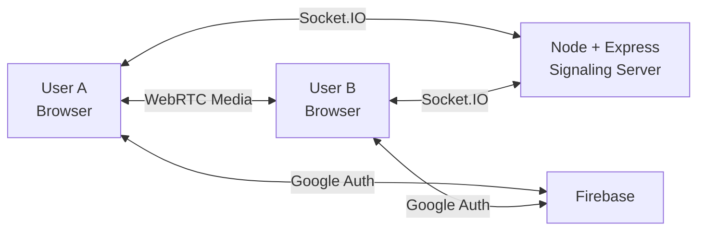

<div align="center">

# 🎬 CineSync

### Watch together. Talk together. Stay in sync.

A real-time watch-party platform for watching videos with friends while staying connected through **synchronized playback, video calls, screen sharing, live chat, and reactions**.

<p>
  
  
  
  
  
  
  
</p>

<p>
  <a href="https://github.com/Manvith-S-Shetty/CineSync/issues">Report a Bug</a> ·
  <a href="https://github.com/Manvith-S-Shetty/CineSync/issues">Request a Feature</a> ·
  <a href="https://github.com/Manvith-S-Shetty/CineSync">Repository</a>
</p>

</div>

---

## ✨ Why CineSync?

Long-distance movie nights should not feel long-distance.

CineSync brings the essential parts of a shared movie night into one browser experience: create a room, connect with friends, communicate in real time, and keep everyone watching the same moment together.

> **One room. One timeline. Everyone together.**

---

## 🚀 Features

| Feature | What it does |
| --- | --- |
| 🎬 **Synchronized Playback** | Keeps playback actions synchronized between participants. |
| 📹 **Video Calling** | Real-time peer-to-peer video communication with WebRTC. |
| 🖥️ **Screen Sharing** | Share your screen with other participants. |
| 💬 **Live Chat** | Real-time room communication. |
| ❤️ **Emoji Reactions** | React without interrupting the watch experience. |
| 📌 **Video Layout Controls** | Pin or maximize the video experience. |
| 🔐 **Google Authentication** | Firebase-powered Google sign-in. |
| 🌐 **Multi-device Support** | Designed for modern desktop and mobile browsers. |

---

## 🧠 Architecture

CineSync separates **real-time coordination** from **real-time media**.

- **React + Vite** → watch-party interface
- **Socket.IO** → rooms, chat, synchronization, and WebRTC signaling
- **WebRTC** → peer-to-peer audio/video/screen media
- **Firebase** → authentication and user identity
- **Node.js + Express** → signaling backend



### WebRTC connection flow

```text
User A              Signaling Server              User B
  │                        │                         │
  │── Join / Room ────────>│<──── Join / Room ──────│
  │                        │                         │
  │── SDP / ICE ──────────>│──── SDP / ICE ────────>│
  │                        │                         │
  │<════════════ Direct WebRTC Media ══════════════>│
```

The signaling server exchanges connection information; media is designed to flow peer-to-peer between browsers.

---

## 🛠️ Tech Stack

### Frontend

`React 18` · `Vite` · `Tailwind CSS` · `React Router` · `Socket.IO Client` · `Three.js` · `React Three Fiber` · `GSAP` · `Firebase`

### Backend

`Node.js 18+` · `Express.js` · `Socket.IO` · `Firebase Admin SDK` · `CORS` · `dotenv`

### Deployment

`Vercel` for the frontend · `Render` for the signaling server

---

## 📁 Project Structure

```text
CineSync/
├── NavPanel/                  # React + Vite frontend
│   ├── src/
│   ├── public/
│   ├── package.json
│   └── vercel.json
│
├── VisionBridge/              # Node.js + Socket.IO backend
│   ├── server.js
│   ├── package.json
│   └── .env.example
│
├── DEPLOY.md                  # Production deployment guide
├── SECURITY.md                # Security policy
├── LICENSE                    # MIT License
├── README.md
└── package.json
```

---

## ⚡ Getting Started

### Prerequisites

- [Node.js 18+](https://nodejs.org/)
- npm
- Firebase project with Google Authentication enabled

### 1. Clone

```bash
git clone https://github.com/Manvith-S-Shetty/CineSync.git
cd CineSync
```

### 2. Install dependencies

```bash
cd NavPanel
npm install

cd ../VisionBridge
npm install
```

### 3. Configure the frontend

Create `NavPanel/.env`:

```env
VITE_BACKEND_URL=http://localhost:5000
VITE_FIREBASE_API_KEY=your_api_key
VITE_FIREBASE_AUTH_DOMAIN=your_auth_domain
VITE_FIREBASE_PROJECT_ID=your_project_id
VITE_FIREBASE_STORAGE_BUCKET=your_storage_bucket
VITE_FIREBASE_MESSAGING_SENDER_ID=your_messaging_sender_id
VITE_FIREBASE_APP_ID=your_app_id
```

Create `VisionBridge/.env` using `VisionBridge/.env.example` as the reference.

> Never commit real Firebase credentials, service-account keys, or other secrets.

### 4. Run the backend

```bash
cd VisionBridge
npm start
```

### 5. Run the frontend

In a second terminal:

```bash
cd NavPanel
npm run dev
```

Open the Vite URL shown in your terminal.

---

## 🌍 Deployment

| Component | Platform | Responsibility |
| --- | --- | --- |
| Frontend | **Vercel** | React/Vite SPA, authentication, WebRTC UI |
| Backend | **Render** | Node.js, Socket.IO rooms, chat sync, WebRTC signaling |

For the complete production setup, see [`DEPLOY.md`](./DEPLOY.md).

---

## 🔒 Security

CineSync uses Firebase Authentication and includes a dedicated security policy.

If you discover a security vulnerability, follow [`SECURITY.md`](./SECURITY.md) instead of publicly posting sensitive details.

---

## 🐛 Known Limitations

CineSync is under active development.

- Video-link ingestion is currently being refined.
- Direct video sources such as `.mp4` are the intended video-player input format in the current implementation.
- WebRTC behavior depends on browser permissions, network conditions, and ICE/STUN/TURN configuration.
- Screen sharing and multi-device behavior depend on browser capabilities.

See the [GitHub Issues](https://github.com/Manvith-S-Shetty/CineSync/issues) page for current bugs and improvements.

---

## 🗺️ Roadmap

- [x] Real-time room communication
- [x] WebRTC video calling
- [x] Screen sharing foundation
- [x] Live chat
- [x] Emoji reactions
- [x] Firebase Google Authentication
- [x] Vercel + Render deployment architecture
- [ ] Improve video-link ingestion
- [ ] Improve cross-device reliability
- [ ] Strengthen production error handling
- [ ] Expand automated testing
- [ ] Improve connection recovery

---

## 🤝 Contributing

1. Fork the repository.
2. Create a branch:

```bash
git checkout -b feature/your-feature
```

3. Make and test your changes.
4. Commit:

```bash
git commit -m "feat: add your feature"
```

5. Push and open a Pull Request.

Bug reports and feature requests are welcome through [GitHub Issues](https://github.com/Manvith-S-Shetty/CineSync/issues).

---

## 📚 Documentation

| Document | Purpose |
| --- | --- |
| [`DEPLOY.md`](./DEPLOY.md) | Production deployment instructions |
| [`SECURITY.md`](./SECURITY.md) | Security reporting policy |
| [`LICENSE`](./LICENSE) | MIT License |

---

## 👨‍💻 Author

**Manvith S Shetty**

Computer Science Engineering student and developer building CineSync as a real-time full-stack project focused on **WebRTC, Socket.IO, authentication, and collaborative web experiences**.

- GitHub: [@Manvith-S-Shetty](https://github.com/Manvith-S-Shetty)
- Project: [CineSync](https://github.com/Manvith-S-Shetty/CineSync)

---

## 📄 License

CineSync is released under the **MIT License**. See [`LICENSE`](./LICENSE) for the full license text.

---

<div align="center">

### 🎬 CineSync

**Distance shouldn't stop movie night.**

⭐ Star the repository if you find the project interesting.

</div>
